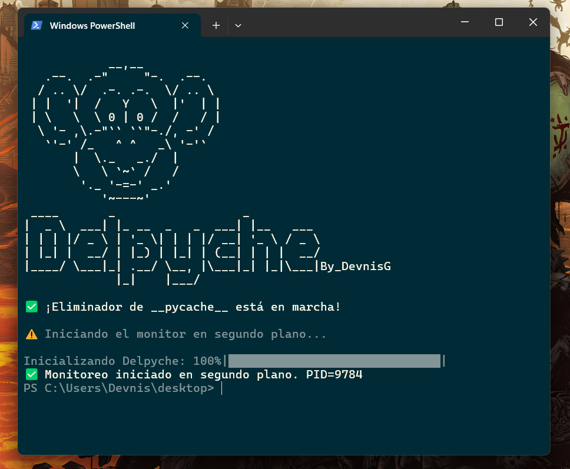
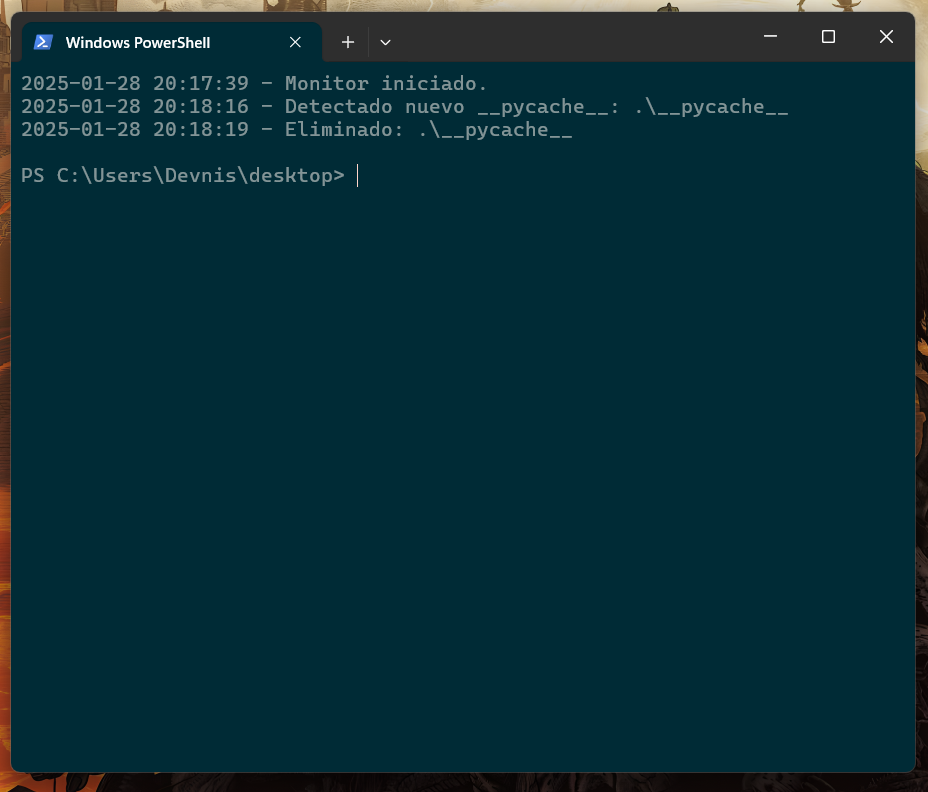

# Delpyche

Delpyche es un proyecto **Open Source** con licencia **MIT**, gratuito y diseñado para **eliminar carpetas `__pycache__`** de manera automática en tus proyectos de Python.  
Con Delpyche, podrás **mantener tu entorno de desarrollo más limpio** y ordenado, sin tener que preocuparte por los residuos de compilación que genera Python.

## ¿Qué es Delpyche y para qué sirve?

Delpyche ofrece las siguientes funcionalidades clave para **gestionar y eliminar** las carpetas `__pycache__`:

- **Monitorización automática**:  
  Activa un servicio que vigila en segundo plano el directorio indicado (y sus subdirectorios), eliminando cualquier carpeta `__pycache__` que aparezca.

- **Configuración personalizable**:  
  Ajusta el **tiempo de espera** entre la detección y la eliminación, así como la **ruta** a monitorear y el **idioma** de la app.

- **Limpieza rápida**:  
  Si lo necesitas, puedes limpiar manualmente logs, archivo PID y la configuración.

- **Logs e información**:  
  Mantiene un registro de toda la actividad (detección y eliminación de carpetas `__pycache__`), que puedes consultar con un simple comando.

- **Gestión sencilla**:  
  Permite iniciar, detener, reiniciar, ver el estado del monitor y ver/editar la configuración.

## Instalacion de la version compilada:

Descarga e instala  siguiendo el proceso de instalación estándar.
- El instalador **Delpy.exe** añadirá la ruta al **Path** del sistema, permitiendo ejecutarlo desde cualquier terminal al iniciar un proyecto.

## ¿Cómo se utiliza?

### Requisitos Previos (Desarrollo)

- **Sistema operativo**: Windows 10 o superior.  
- **Python**: Versión 3.7 o superior.  
- **Dependencias**: Listadas en `requirements.txt`.  
- **Permisos de escritura**: El usuario que ejecute Delpyche debe poder crear y eliminar directorios en la ruta monitoreada.

### Uso Básico

1. **Iniciar el monitor**:  
   ```bash
   delpy start
   ```
   Arranca un proceso en segundo plano que vigila y elimina `__pycache__`.

2. **Ver el estado**:  
   ```bash
   delpy status
   ```
   Muestra si el proceso está en ejecución.

3. **Detener el monitor**:  
   ```bash
   delpy stop
   ```
   Finaliza el proceso que monitorea.

4. **Reiniciar el monitor**:  
   ```bash
   delpy restart
   ```
   Detiene y vuelve a iniciar el proceso de monitoreo en un solo comando.

5. **Ver o editar configuración**:
   - Para ver la configuración actual (ruta monitoreada, delay, lenguaje, etc.):  
     ```bash
     delpy config
     ```
   - Para ajustar el tiempo de espera, en segundos:  
     ```bash
     delpy set <segundos>
     ```
   - Para establecer la ruta de monitoreo:  
     ```bash
     delpy path <ruta>
     ```

6. **Limpiar logs y configuración**:  
   ```bash
   delpy clean
   ```
   Borra la carpeta de logs, el archivo PID y la configuración guardada.

7. **Ver logs**:  
   ```bash
   delpy info
   ```
   Muestra en pantalla la bitácora de detecciones y eliminaciones.

8. **Cambiar el idioma**:  
  Soporta español (ES) e inglés (EN):
  ```bash
  delpy lang en
  ```
  Para volver a español:
  ```bash
  delpy lang es
  ```

## Ejemplos de uso

- **Eliminar `__pycache__` al vuelo**:  
  Inicia el servicio con `delpy start` y simplemente trabaja en tus proyectos Python. Si en algún momento se generan las carpetas `__pycache__`, Delpyche las eliminará de forma automática.
  
- **Cambiar la ruta a monitorear**:  
  Útil si trabajas con varios proyectos o quieres mover el monitor a otra carpeta.  
  ```bash
  delpy path C:\Users\Tu_Usuario\Mis_Proyectos
  delpy restart
  ```
  (Tras cambiar la ruta, es recomendable reiniciar el monitor.)

### Clonar el repositorio

```bash
git clone https://github.com/DevnisG/Delpyche
cd delpyche
```

### Instalar dependencias

```bash
pip install -r requirements.txt
```

### Ejecutar la aplicación

Una vez en el directorio del proyecto:

```bash
python delpy.py 
```

Esto mostrará los comandos disponibles:
- **start**
- **stop**
- **restart**
- **status**
- **config**
- **info**
- **clean**
- **set**
- **path**
- **lang**

## Contribuciones al Proyecto

Delpyche es **código abierto**. ¡Todas las contribuciones son bienvenidas!  
Para colaborar:

1. Haz un **fork** del repositorio.
2. Crea una rama para tu funcionalidad:
   ```bash
   git checkout -b feature/mi-nueva-feature
   ```
3. Realiza los cambios y confirma el commit:
   ```bash
   git commit -m "Mi nueva característica en Delpyche"
   ```
4. Sube los cambios a tu rama:
   ```bash
   git push origin feature/mi-nueva-feature
   ```
5. Abre un **Pull Request** en el repositorio original.

## Contacto

Este proyecto fue desarrollado por [Devnis](https://github.com/DevnisG).  
Si tienes **preguntas**, **sugerencias** o **comentarios**, no dudes en abrir un **Issue** o contactarme vía:

- **Correo electrónico**: <denis.gontero.2000@gmail.com>  
- **Discord**: *Devnis*  

## Licencia

Delpyche se distribuye bajo la **licencia MIT**. Consulta el archivo [LICENSE](LICENSE) para más detalles.  

¡Gracias por usar Delpyche! Espero que te ayude a mantener tu entorno Python **limpio** y **organizado**, sin `__pycache__`.

## Vista Previa

**Start**
 

**Info**
 
